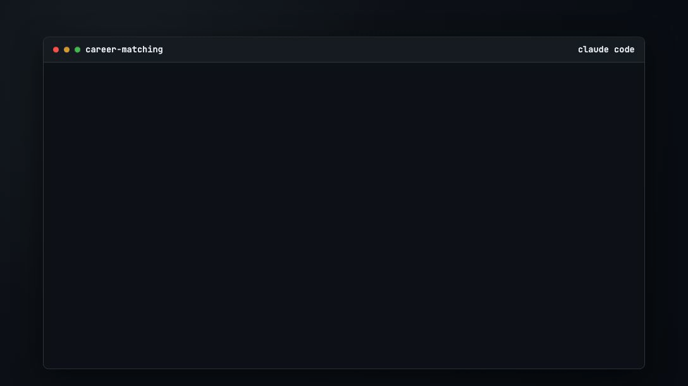

# Career Matching Agent

Find live roles, rank them against your background, and get application briefs for the matches worth pursuing.

No coding experience required.



## Quick start

**Prerequisite:** Claude Code installed and authenticated. [Setup instructions](https://code.claude.com/docs/en/quickstart).

1. Paste this command into **Terminal** (Mac) or **PowerShell** (Windows):

```bash
git clone https://github.com/ryan-hennebry/career-matching.git && cd career-matching && claude --dangerously-skip-permissions
```

2. In Claude Code, upload your CV when the agent asks, then answer the onboarding questions one at a time.

## The onboarding flow

- Paste or upload your CV
- Confirm or correct the profile the agent extracts
- Add any skills that are missing from the CV
- Choose the role types and industries you want to target
- Set location preferences and minimum salary
- The agent searches job boards, ranks the results, and asks which roles you want application briefs for
- If you want, you can set up email digests later in chat

## What you receive

Each run produces a shortlist with:

- Job matches scored across required and preferred skills, experience, industry, location, and salary
- A clear view of what is new today versus still active
- Reasons each role fits, where the gaps are, and which opportunities look strongest
- Application briefs for chosen roles, including CV tailoring, cover letter talking points, and outreach drafts
- If configured, an email digest delivered to your inbox

## Once your first output has been generated

Keep working with the agent in Claude Code for deeper analysis:

- "Show only the jobs that are new today."
- "Which roles mention AI agents or Claude Code?"
- "Why did this role score higher than the others?"
- "Prepare application briefs for roles 1 and 3."
- "Mark this one rejected and keep tracking the rest."

## Optional delivery

If you want ongoing updates:

- **Receive an email digest:** when the agent asks, open [Resend](https://resend.com/api-keys), create an API key, and paste it into chat

## The agent's output

- Ranked roles in a table showing score, title, company, location, and source links
- A pipeline view of new, reviewing, brief-requested, applied, rejected, and expired jobs
- Per-job detail views with requirements met, gaps, score breakdown, and the original listing
- Application briefs with CV tailoring, cover letter talking points, outreach drafts, and application checklists
- If configured, an email digest for ongoing updates on new roles that are a good fit

## How it works

<picture>
  <source media="(prefers-color-scheme: dark)" srcset="assets/how-it-works-dark.svg">
  
</picture>

## Project standards

- [MIT License](LICENSE)
- [Security Policy](SECURITY.md)
- [Contributing Guide](CONTRIBUTING.md)
