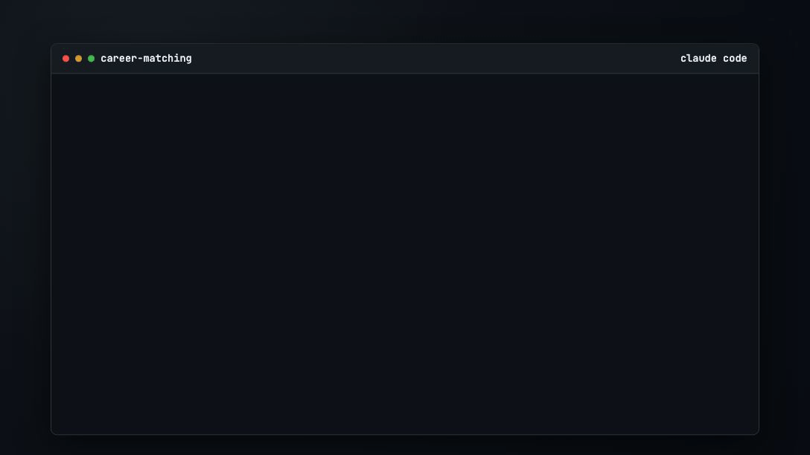

# Career Matching

Find live roles and rank them by experience and career-goal fit.

It turns your CV and preferences into a search profile, searches job boards, and keeps track of what is new, active, rejected or expired.

No coding experience required.



## Quick start

1. [Install Claude Code](https://code.claude.com/docs/en/quickstart).
2. Paste this into **Terminal** (Mac) or **PowerShell** (Windows):

```bash
git clone https://github.com/ryan-hennebry/career-matching.git && cd career-matching && claude --permission-mode auto
```

Upload your CV and follow the onboarding. It builds your search profile, asks what you're looking for, then finds and ranks live roles.

## Matches

- Score, title, company, location and source
- Why each role fits and where the gaps are
- What's new today and what's still active

## Ask follow-up questions

- "Show only the jobs that are new today."
- "Why did this role score higher than the others?"
- "Mark this one rejected and keep tracking the rest."

For any role you want to pursue, ask it to prepare an application brief.

## Dashboard

The optional dashboard tracks roles through new, reviewing, applied, rejected and expired, with a score breakdown for each job.

## Updates

Set up an email digest if you want new matches sent to you.

## How it works

<picture>
  <source media="(prefers-color-scheme: dark)" srcset="assets/how-it-works-dark.svg">
  
</picture>
